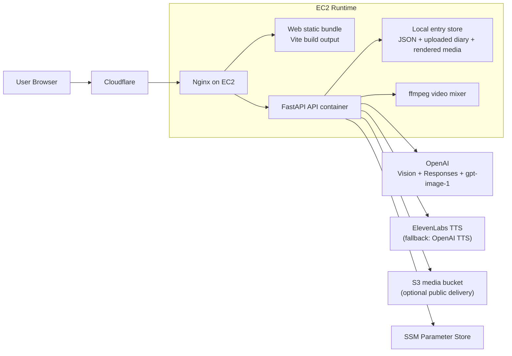
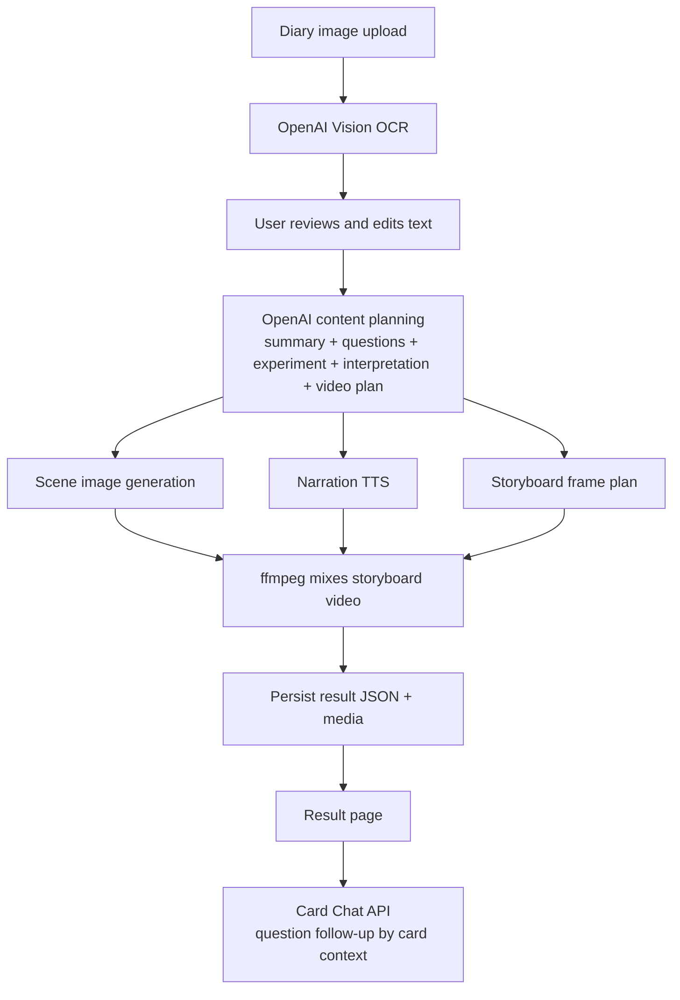
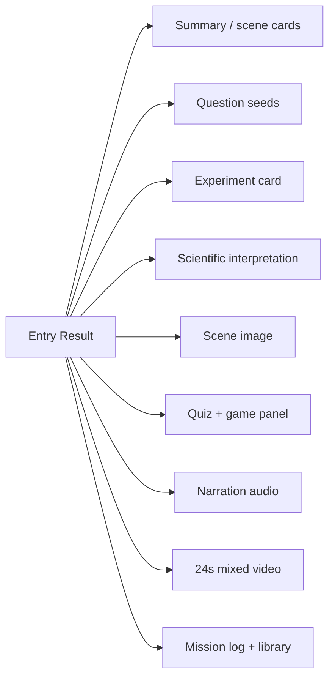
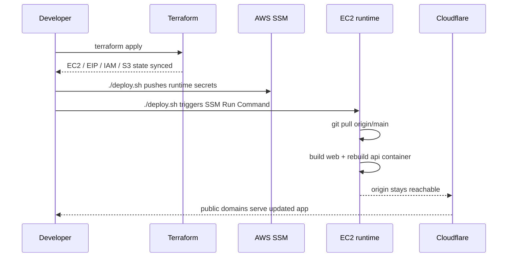

# kwail Architecture

이 문서는 현재 배포된 kwail의 실제 구조를 기준으로 정리한 아키텍처 문서입니다.

핵심 원칙은 두 가지입니다.

- 지금 돌아가는 구조만 적습니다.
- 미래 구상은 현재 구조와 섞지 않습니다.

## 1. 서비스 아키텍처

### 메모

- 공개 도메인은 Cloudflare가 받습니다.
- 실제 런타임은 EC2 한 대입니다.
- 웹 정적 파일과 API는 같은 EC2의 Nginx 뒤에서 서비스됩니다.
- 영상은 Sora를 기본으로 쓰지 않고, 이미지 시퀀스를 ffmpeg로 합성합니다.

## 2. AI 처리 흐름

### 메모

- 현재 메인 경로는 단일 오케스트레이션 파이프라인입니다.
- Card Chat은 생성 완료 후 카드별 질문을 이어주는 보조 인터랙션입니다.
- 즉, “멀티 에이전트가 각각 따로 결과를 만든다”가 아니라 “하나의 결과를 만든 뒤 카드별 대화를 붙인다”가 현재 상태에 맞는 설명입니다.

## 3. 결과물 구조

## 4. 배포 플로우

## 5. 현재 공개 엔드포인트

- App: [https://diary-app.summit1123.co.kr](https://diary-app.summit1123.co.kr)
- API: [https://diary-api.summit1123.co.kr](https://diary-api.summit1123.co.kr)

## 6. 문서 범위 밖

아래는 현재 기본 아키텍처 문서 범위 밖입니다.

- Sora를 기본 영상 파이프라인으로 쓰는 구조
- 진짜 멀티 에이전트 워커 오케스트레이션
- 교실/LMS 연동
- 실시간 멀티유저
