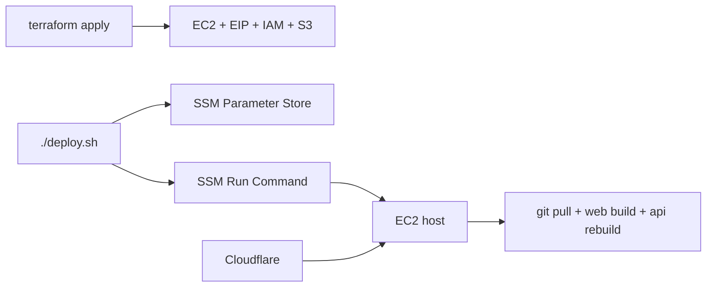

# Terraform Management

이 저장소는 해커톤 서비스 인프라를 `infra/service` 단일 Terraform 루트로 관리합니다.

지금 기준의 실제 배포 모양은 아래와 같습니다.

- EC2 1대
- Elastic IP 1개
- EC2 내부 Nginx + API 컨테이너
- Cloudflare public hostname
- SSM Parameter Store
- 선택적 S3 미디어 버킷

## 현재 운영 흐름



## 디렉터리

- `infra/service`: 현재 서비스용 Terraform 루트
- `infra/service/imports.md`: 기존 리소스 import 순서
- `scripts/aws_inventory.sh`: AWS 인벤토리 확인용 보조 스크립트

## 빠른 시작

```bash
cp infra/service/backend.hcl.example infra/service/backend.hcl
cp infra/service/terraform.tfvars.example infra/service/terraform.tfvars
```

```bash
terraform -chdir=infra/service init -backend-config=backend.hcl
terraform -chdir=infra/service plan
terraform -chdir=infra/service apply
```

## 배포

코드 배포는 Terraform과 분리해서 갑니다.

```bash
./deploy.sh
```

필요하면 Terraform도 같이 돌릴 수 있습니다.

```bash
DEPLOY_RUN_TERRAFORM=1 ./deploy.sh
```

## 현재 공개 도메인

- App: `https://diary-app.summit1123.co.kr`
- API: `https://diary-api.summit1123.co.kr`

Cloudflare에서는 두 호스트를 모두 같은 EC2 origin IP로 프록시합니다.

## 운영 메모

- API 컨테이너는 OCR, 이미지 생성, TTS, ffmpeg 믹싱을 담당합니다.
- 웹은 EC2에서 빌드한 정적 파일을 Nginx가 서빙합니다.
- 런타임 시크릿은 SSM에 저장하고, 배포 시 EC2에서 받아 씁니다.
- 오래된 미디어도 EC2 공유 데이터 경로 또는 S3에서 다시 제공할 수 있게 맞춰 둡니다.
